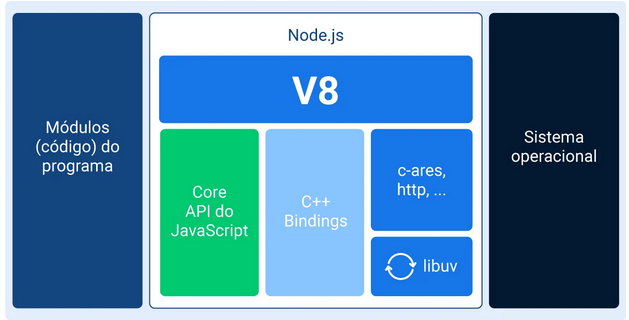
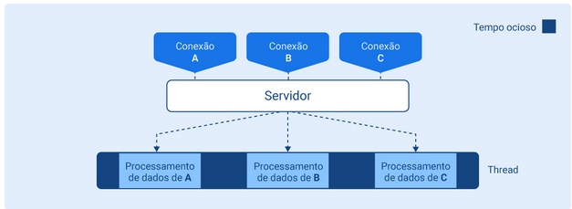
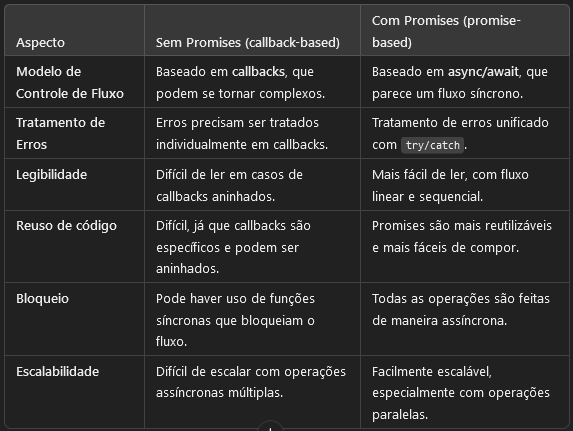

# O que é Node?
Pela definição oficial (https://nodejs.org/en/about/), é um runtime, ou seja, interpretador de JavaScript assíncrono orientado a eventos. Isso significa que o Node fica na espera de eventos serem disparados para executar uma ação.

## Os componentes do Node.js
 Node.js é composto por algumas bibliotecas e  alguns conceitos importantes para o Node.js, como assincronicidade, threads e callbacks.

    
    • Core API (“API essencial”) do JavaScript, responsável pela implementação do Node.js em alto nível;

    • C++ bindings, responsáveis por englobar e expor bibliotecas e métodos em C++ que são utilizados através do Node.js;

    • V8, o motor de execução que faz com que o Node.js consiga compreender o código escrito em JavaScript. Escrito em C++, V8 recebe uma string de código em JavaScript, interpreta e executa. É onde se encontra a implementação da maior parte das funções e métodos JavaScript;

    • libuv, uma das principais partes que compõem o Node.js. É uma biblioteca escrita em C++ que faz a parte de manipulação de eventos e o manejo de processos assíncronos como timers e funções. Esta lib dá acesso do Node.js ao sistema operacional, ao sistema de arquivos (o conhecido fs - file system), conexões e etc. Além disso, delega a execução de algumas partes do programa ao sistema operacional, caso necessário. A libuv também implementa duas funcionalidades muito importantes: o loop de eventos e a thread pool;

    • Outras APIs como http-parser, zlib, openSSL e c-ares, que fazem parte do ambiente Node.js mas não fazem parte da V8.

    fonte: https://www.alura.com.br/artigos/arquitetura-node-js-seus-componentes

## Singlethread
O Node é considerado monothread. Mas , antes iremos relebrar que thread são a menor unidade de processamento de um programa , ou seja , são a forma como as instruções de um programa são estruturadas e "agendadas" para serem processadas pelo computador .

## Uma analogia que explica um pouco funcionamento:

    • Processador (Confeiteiro): O confeiteiro é quem realiza as ações, assim como o processador executa as instruções.

    • Processo (Livro de Receitas): Um processo é como um livro de receitas, que contém várias tarefas (receitas) que precisam ser realizadas.

    • Thread (Receita): Uma receita específica dentro do livro corresponde a uma thread, ou seja, uma sequência de instruções dentro do processo.

    • Dados (Ingredientes): Os ingredientes (farinha, ovos, açúcar, etc.) são os dados que o processo (confeiteiro) precisa para executar a thread (fazer o bolo).

## Aplicação na Computação:

    •  Em um sistema de computadores, o processador executa processos (programas) que podem ter múltiplas threads (tarefas simultâneas).

     •  O confeiteiro pode ter várias receitas (threads) para seguir, e precisa usar os dados (ingredientes) de maneira organizada para fazer o bolo (finalizar a tarefa).

## Tá mais o que isso Interfere em Node ?

No exemplo acima, o processamento de cada conexão é “agendado” e colocado em fila para execução um após o outro, ao invés de serem “espalhados” por diversas threads.

 • Isso significa que que o Node não é capaz de iniciar novas
threads que executam tarefas em paralelo, como fazem essas outras linguagens(como Java,C#). Por isso, cada processo iniciado pelo Node é considerado monothread.

 • Um sistema monothread não possui a necessidade de
ficar gerenciando threads, evitando o desperdício de processamento e consumo de memória com a criação e manutenção de cada thread .
 
 • Esperar em uma fila a execução de cada requisição ser concluída faria com que a plataforma fosse inviável . Em razaão ,disso, o Node funciona de forma non blocking .

 ## Estudo de Cenário

Contexto : 

1-Um programa precisa acessar os dados da conta de uma pessoa e imprimir na tela algumas dados .

2-Deve verificar o status do cliente na agência, carregar o perfil de investimento do cliente e enviar esses dados para o gerente da conta.

Algoritmo de execução disso leva ,em média :
1. Acessar dados da conta – 40ms
2. Imprimir informações – 10ms
3. Carregar perfil de investimento – 40ms
4. Enviar dados de perfil para gerente – 10ms

• Algoritmo Funciona de forma Sincrona(bloqueante),ou seja um passo bloqueia o  outro , assim levaria cerca de 100ms. 

• Algoritmo  Funciona de forma assincrona (não bloqueante) define-se quais tarefas não precisan de roda de maneira "sincronizado" ,ou seja uma não depende da outra . 

1. Acessar dados da conta – 40ms
        
        1.a) Imprimir informações – 10ms
2. Carregar perfil de investimento – 40ms

        2.a) Enviar dados de perfil para gerente – 10ms

    

TEMPO TEMPO DE EXCUCÇÃO : 50MS      

O passo 2 pode ser executado mesmo se o passo 1 não tiver sido concluído ainda.

Nota : A questão do assincronismo é bem interessante imagine você tivesse que esperar 

## Sistema de Event Loop
    • O que é um Evento em Node ?

1-Podemos pensar em eventos em contextos como leitura e escrita de arquivos, manejo de requisições HTTP .

2-Estes processos emitem eventos quando o processamento é finalizado; algo como um “aviso” para o programa que o processamento foi concluído e o resultado (retorno) pode ser utilizado.

        Event Loop funciona como um programa ouvinte que fica perguntando para cada evento emitido se ele já concluiu o seu processamento. Quando um evento é concluído, ele dispara uma função de retorno(callback) que permite a execução de outras tarefas associadas ou dependentes dele.

3-O Event Loop controla o início e o resultado de cada evento, fazendo com que programas desenvolvidos neste paradigma possam receber dezenas de milhares de requisições e tratá-las de forma paralela .

## O centro da arquitetura do Node.js: o loop de eventos
.gif)

## Porque usar Promises?

